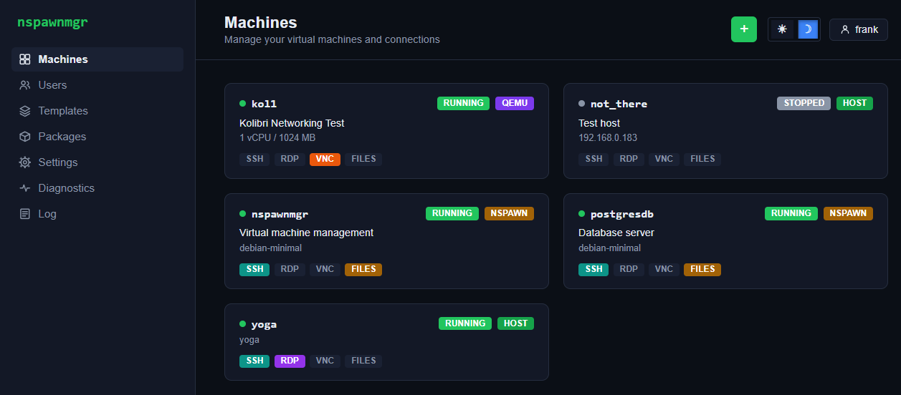

# nspawnmgr

A self-hosted web manager for `systemd-nspawn` containers, Podman pods, and QEMU/KVM virtual
machines — with clientless SSH/RDP/VNC access through [Apache Guacamole](https://guacamole.apache.org/),
right in the browser. No SSH client, RDP client, or VNC viewer needed on the connecting machine.



## What it does

- **Three backends, one interface.** Create and manage `systemd-nspawn` containers, Podman pods,
  and QEMU/KVM virtual machines from the same Machines page — each gets a colored badge
  (`NSPAWN`/`PODMAN`/`QEMU`), and arbitrary network machines you don't want nspawnmgr to manage the
  lifecycle of can be registered as a `HOST` entry instead, reachable through the same SSH/RDP/VNC
  flow.
- **Clientless remote access.** Every SSH, RDP, and VNC connection opens inside the browser via
  Guacamole — nothing to install on the machine you're connecting *from*.
- **Ownership and sharing.** Every machine has an owner; owners can share access with other users,
  and admins can see and take ownership of anything. Nothing is public by default.
- **Template-driven provisioning.** Container/pod/VM images are managed as reusable templates,
  including one-click "set up a minimal Debian/Fedora/Arch template" buttons, template creation
  from an existing (stopped) machine, and an SSH-invoked CLI for publishing templates and packages
  from a CI/CD pipeline.
- **A shared package cache** (APT/DNF/PACMAN/APK, plus ISO images for removable media) that admins
  populate once and any container owner can install from, with dependency pre-fetching so a
  container never has to resolve its own package mirrors live.
- **Container-to-container DNS**, custom inbound port mappings, and a per-container outbound
  internet access toggle with an allowlist — all self-service, no admin needed.
- **Self-hosted.** nspawnmgr runs from inside its own managed `systemd-nspawn` machine, alongside
  its own database machine — both show up as ordinary, manageable containers in its own UI.
- **Admin-approval mode** for container creation when you'd rather not store a sudo password at
  all, with a combined Requests page for reviewing pending creations and in-container user-account
  requests.

## Documentation

- **[Administrator's Guide](docs/administrator-guide.md)** — setting up a real deployment from
  scratch: the host, the database, Tomcat, Guacamole, the `auth` login app, and nspawnmgr itself.
  Start here to actually install and run this.
- **[`site/env/README.md`](site/env/README.md)** and **[`dev_env/README.md`](dev_env/README.md)**
  — the local development loop (fakes, no real containers, no real Guacamole).

## Quick start (real deployment)

Debian/Ubuntu hosts only, via the `.deb` package (see the [Administrator's
Guide](docs/administrator-guide.md) for everything this doesn't cover — HTTPS, a non-default port,
the sudo-capable account, and more):

```bash
# Build a .deb (or grab a pre-built one from wherever your team publishes it)
mvn -DskipTests install
mvn -f auth/pom.xml -DskipTests package
mvn -f packaging/nspawnmgr-deb/pom.xml package

# Install it
sudo apt install ./packaging/nspawnmgr-deb/target/nspawnmgr_*.deb
```

This sets up the sudo-capable SSH account, the shared container bridge, and boots a self-hosted
`nspawnmgr` machine with Tomcat, all four WARs, and `guacd` already installed inside it. Continue
with the [Administrator's Guide](docs/administrator-guide.md) from there.

## Development

- **`tools/scripts/start-dev-stack.sh`** — builds and runs the full stack (nspawnmgr, auth, a fake
  Guacamole) against fakes for `machinectl`/`podman`/QEMU, so it works without root or a real
  container host.
- **`tools/web-test-harness/`** — a dependency-free browser test runner (plain HTML/JS, no npm, no
  build step) that drives the real server-rendered pages in their own tabs and asserts on their
  live DOM. Deployed alongside the dev stack at `http://localhost:8080/test-harness/`.
